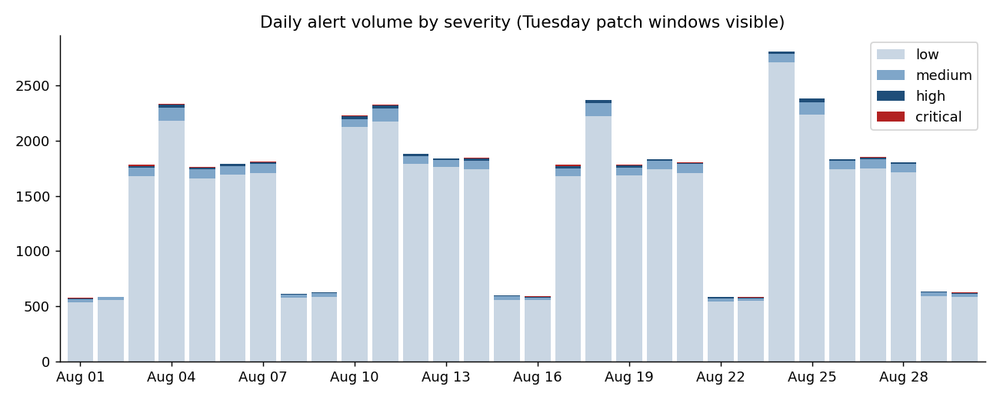
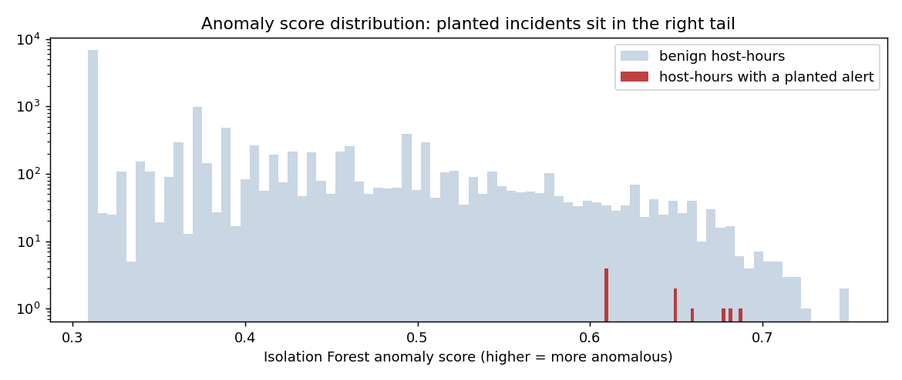

# SOC Alert Analytics

_Portfolio sprint timeline: January–September 2026. Reported results retain their actual run dates._

SQL analytics over SIEM alerts and analyst triage logs: noisy-rule tuning report, time-to-triage
SLAs, MITRE ATT&CK coverage gaps, anomaly-based burst detection, and attack-chain reconstruction.
Built to answer the questions a SOC lead asks at a monthly review.

**Read the results:** [REPORT.md](REPORT.md) · per-question output in [`results/`](results/)



## What's in it

| | |
|---|---|
| Input | Wazuh `alerts.json` (one JSON object per line) + a CSV of analyst actions |
| Engine | DuckDB, reading JSON and CSV directly; no server |
| Queries | 12, in [`sql/`](sql/), each a self-contained question |
| ML | [`ml/`](ml/): Isolation Forest over per-host-hour behaviour, evaluated against planted incidents |
| Generator | [`scripts/generate.py`](scripts/generate.py) produces 30 days of realistic alerts with business-hours volume, weekly patching storms, noisy rules, and three planted attack chains |

### Why synthetic data

Real SIEM exports contain hostnames, usernames and IPs that should not be on GitHub. The
generator reproduces the *shape* of a small SOC's alert stream so the queries have something
realistic to find — and the planted incidents give a ground truth to check the anomaly queries
against. To run it on your own Wazuh data instead:

```bash
cp /var/ossec/logs/alerts/alerts.json data/alerts.jsonl    # on the Wazuh manager
# triage.csv: export from your ticketing tool with columns alert_id,opened_at,closed_at,analyst,disposition,escalated
python scripts/build_db.py && python scripts/run.py
```

## Run it

```bash
git clone https://github.com/prhoguns/soc-alert-analytics.git
cd soc-alert-analytics
docker build -t soc-analytics .
docker run --rm -v "$PWD":/app --entrypoint python soc-analytics scripts/generate.py
docker run --rm -v "$PWD":/app --entrypoint python soc-analytics scripts/build_db.py
docker run --rm -v "$PWD":/app soc-analytics          # all 12 queries + 4 charts
docker run --rm -v "$PWD":/app soc-analytics 07 09    # just the ones you want
```

Or without Docker: `pip install -r requirements.txt` and run the same `python scripts/...` commands.

## Anomaly detection (ml/)

Rules find what you already know to look for. `ml/` asks the other question: which host-hours are
*unusual for that host*, with no labels and no signatures?

- **Features** ([`ml/features.py`](ml/features.py)): one row per (host, hour) — alert count, distinct rules,
  users, source IPs, external IPs, per-tactic counts, max/avg severity — expressed as **per-host robust
  z-scores, positive part only** (a host doing *more* than its own median, in MAD units), with the weekly
  Tuesday patch window baselined separately so FIM storms are "normal for a patch window".
- **Model** ([`ml/train.py`](ml/train.py)): Isolation Forest, 300 trees, unsupervised. Compared against a
  transparent excess-sum heuristic and a raw-volume baseline, then combined (best rank of forest and heuristic).
- **Evaluation**: the generator records which alerts it planted, so precision/recall at top-k and the rank
  of each planted incident are measured, not asserted.

Result ([`ml/results.md`](ml/results.md)): 13,675 host-hours, 10 malicious.

| incident | Isolation Forest | excess heuristic | raw volume | **combined** |
|---|---:|---:|---:|---:|
| SSH brute force, vpn-01 | 193 | 1 | 2 | **2** |
| Lateral movement, ws-017 → dc-01 | **46** | 2,173 | 5,596 | **65** |
| Web scan + SQLi, web-01 | 63 | 4 | 1 | **7** |

The volume methods nail the loud attacks and completely miss the quiet one (two alerts, two tactics,
level 12). The forest finds the quiet one in the top 0.4% and under-ranks the loud ones. Combined, all
three incidents are in the top 65 — about two host-hours a day to review. What I learned building it,
in order: raw counts made the forest flag *quiet* hours on busy hosts; per-host normalisation fixed that
but the patch storms then dominated; modelling the maintenance window fixed that.



Run: `docker run --rm -v "$PWD":/app --entrypoint python soc-analytics ml/train.py`

## The questions

| # | Question | Technique |
|---|---|---|
| [01](sql/01_daily_volume_by_severity.sql) | Daily volume by severity band | conditional aggregation |
| [02](sql/02_noisy_rules.sql) | Tuning report: volume × true-positive rate per rule | join to triage, windowed share, CASE recommendation |
| [03](sql/03_time_to_triage_by_severity.sql) | Time-to-triage and SLA attainment by severity | `date_diff`, `quantile_cont` |
| [04](sql/04_night_vs_day_triage.sql) | Triage latency by hour fired | grouping on `extract(hour)` |
| [05](sql/05_mitre_coverage.sql) | ATT&CK tactic coverage and blind spots | `unnest` a reference list, left join |
| [06](sql/06_hourly_heatmap.sql) | Weekday × hour heatmap | two-dimensional grouping |
| [07](sql/07_burst_detection.sql) | Bursts: (rule, host) hours > 5σ above own baseline | `avg`/`stddev` windows, z-score |
| [08](sql/08_top_source_ips.sql) | External IPs by rules triggered and hosts touched | multi-metric ranking |
| [09](sql/09_attack_chain_reconstruction.sql) | Multi-tactic sequences on one host/user in 2 h | self-join on time window, `string_agg` |
| [10](sql/10_analyst_workload.sql) | Analyst throughput and disposition consistency | per-analyst aggregates |
| [11](sql/11_untriaged_high_severity.sql) | High-severity alerts nobody opened | anti-join via left join |
| [12](sql/12_weekly_trend_after_tuning.sql) | Volume if the tuning recommendations were applied | subquery filter, weekly trend |

## Layout

```
scripts/   generate.py · build_db.py · run.py
sql/       one question per file
results/   generated: question, query, result table
charts/    generated PNGs
```
