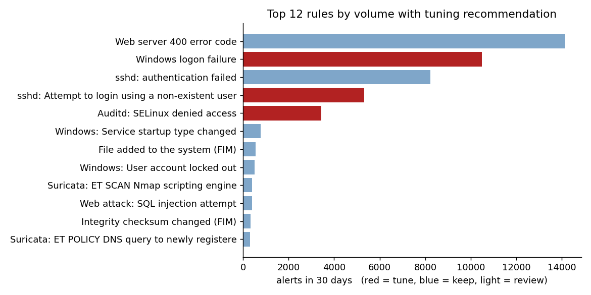
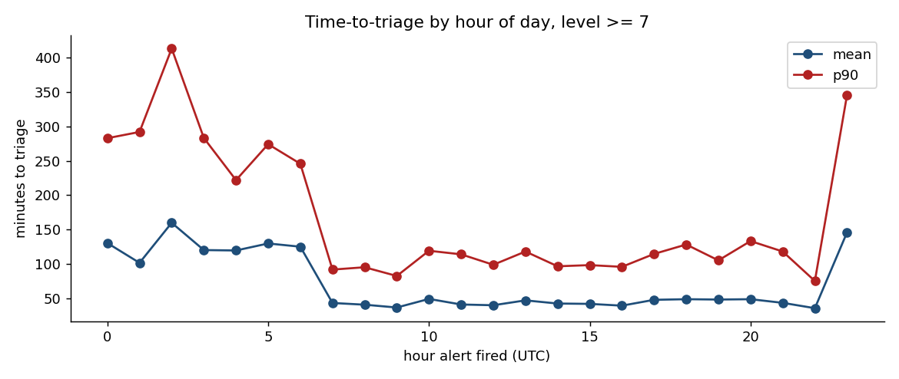
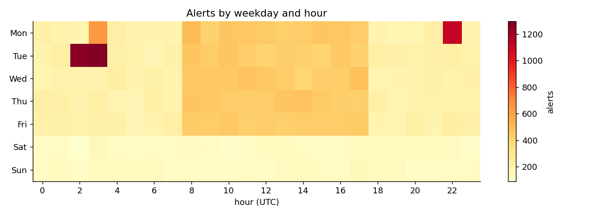

# SOC alert analytics: 30-day review

Twelve questions a SOC lead asks at the monthly review, answered in SQL over 45,839 Wazuh
alerts and 4,647 analyst triage records (August 2026, synthetic — see README for why).
Per-question queries and output are in [`results/`](results/).

## 1. Three rules are 42% of all alerts and are almost never real

| Rule | Alerts (30 d) | True-positive rate |
|---|---:|---:|
| 60122 Windows logon failure | 10,491 | 0.7% |
| 5710 sshd: non-existent user | 5,316 | 0.9% |
| 80710 Auditd: SELinux denied | 3,427 | 0.0% |

Suppressing or aggregating these three (e.g. raise a single alert per source per 10 minutes
instead of one per event) would cut weekly volume by **~41%** with no loss of confirmed
detections ([Q2](results/02_noisy_rules.md), [Q12](results/12_weekly_trend_after_tuning.md)).

"Web server 400 error code" is the single loudest rule (14,137 alerts, 31% of total) but is
*not* a tuning candidate: its 9% true-positive rate comes from the web scan on Aug 24, so the
rule works — it just needs the Wazuh frequency/timeframe correlation (rule 31151) to be the
one analysts look at, not the raw 400s.

## 2. Triage is fast on criticals, slow on mediums

| Severity | Median minutes to triage | p90 | Within SLA |
|---|---:|---:|---:|
| Critical (12+) | 5.8 | 31 | 74% |
| High (10–11) | 14.4 | 58 | 73% |
| Medium (7–9) | 46 | 194 | 58% |

Medium-severity alerts are the problem: 42% miss the 60-minute target, and their p90 is over
three hours ([Q3](results/03_time_to_triage_by_severity.md)). Overnight makes it worse — alerts
fired at 02:00 take a mean of 160 minutes to open versus 42 minutes at 14:00
([Q4](results/04_night_vs_day_triage.md)). Either the night shift needs a second analyst
during the 00:00–04:00 window, or medium alerts need auto-enrichment so they are faster to close.

## 3. Four ATT&CK tactics have no detection at all

Lateral Movement, Defense Evasion, Collection and Exfiltration have zero rules
([Q5](results/05_mitre_coverage.md)). The lateral-movement chain on Aug 17 was caught only
because its *other* stages (PowerShell, LSASS, new admin, C2) fired. Priority additions:
Windows 4624 logon type 3/10 correlation for lateral movement, and Sysmon event 11/23 for
staging and deletion.

## 4. The month's real incidents, found by the queries

- **Aug 10, 03:00 – SSH brute force against vpn-01** from 185.220.101.44: 421 failures in an
  hour (z = 22.8 against that host's baseline of 3/hour) followed by rule 40111 *"failures
  followed by a success"* — the account `svc-backup` was compromised ([Q7](results/07_burst_detection.md)).
- **Aug 17, 14:22 – Lateral movement from ws-017 to dc-01** by `user23`: encoded PowerShell →
  LSASS access → new account `helpdesk2` added to Domain Admins → scheduled task on the DC →
  six hours of Cobalt Strike beacons. Five tactics across two hosts in two hours; the
  chain-reconstruction query ranks it first ([Q9](results/09_attack_chain_reconstruction.md)).
- **Aug 24, 22:00 – Web scan and SQL injection** against web-01 from 185.220.104.201:
  916 requests and 36 SQLi attempts in one hour.

All three were planted by the generator; the point is that generic anomaly queries
(z-score per rule/host, distinct tactics per window) surface them without any signature.

## 5. Staffing shape

Alert volume is 2–3× higher 08:00–18:00 on weekdays, and the Tuesday 02:00–04:00 patch window
produces the busiest hours of the week from file-integrity noise ([Q6](results/06_hourly_heatmap.md)).
FIM alerts during a known patch window should be suppressed by schedule.

## 6. Analyst consistency

The four analysts closed 1,118–1,240 alerts each with false-positive rates of 67.7–68.8% —
tight enough that triage criteria are being applied consistently
([Q10](results/10_analyst_workload.md)). Every level ≥ 7 alert was triaged
([Q11](results/11_untriaged_high_severity.md)).

## Recommendations, in order

1. Tune rules 60122, 5710, 80710 (aggregate by source, raise threshold). −41% volume.
2. Schedule-suppress FIM during the Tuesday patch window.
3. Add lateral-movement and exfiltration detections (four blind-spot tactics).
4. Second analyst or auto-enrichment for the 00:00–04:00 window; medium-severity SLA is at 58%.
